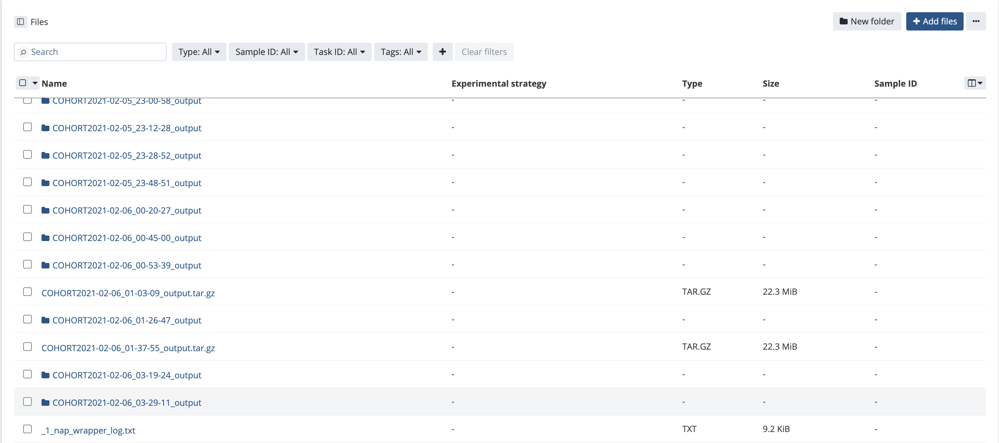

# NAP instance for running in Seven Bridges Platform

## Purpose

Aim of this folder is to provide Sleep researchers with resources to run NAP on Sleep Cohorts within Seven Bridges Platform.

## Pre-requisites

Following are needed to run NAP in Seven Bridges Platform
1. User account in Seven Bridges platform
2. Sleep cohorts as private files within a Seven Bridges project or public dataset info
3. User-defined NAP Configuration file (refer example file nap_7b.conf) 

## How to run NAP

1. Create new Tool -> Go to Projects -> Choose a project -> Click on  Apps -> 
   "Add App" -> "Create New App" -> "Create a Tool" 

2. Copy the NAP CWL json file (cwl_nap.json) and paste into the new tool,
   Select the new app -> Click Edit -> Click on Code
   Replace all the default content listed in the Code section with NAP CWL json file content

3. As the label is listed as "nap", tool will be renamed to "nap". If you want to rename the tool name, you will have to update the "label" key value with the new tool name. Also, update the cohort info, for example if dataset is ABC then go to arguments section and update valueFrom as "ABC"

4. Click on Run and Save button at the top right corner.

5. Now, you will be prompted to provide Input ports with Cohort folder (to perform analysis on) and NAP configuration file.

6. Once input ports selections is complete, Click on "Run" to start the app

## Output

Output will be listed in the Project's Files section. Based on the NAP_OUTPUT variable value in the configuration file, output may be in the form of Folder or Tar file

Successful NAP CWL run output_options

## Notes

1. In the app, run_label may have to be updated from time to time for different Cohorts to correctly reflect the (to-be-run-on) Cohort's canonical information from the common/sigs.canonical file. To make the change, 
 - Option 1: Update through Visual editor - Click on Edit the app -> go to Visual editor -> replace the argument value with the appropriate Cohort identifier
 - Option 2: Update through code - update valueFrom under arguments with the appropriate Cohort identifier
